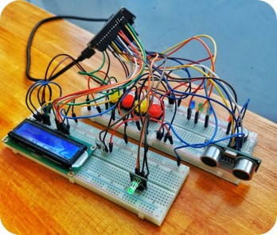
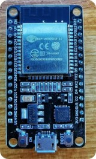
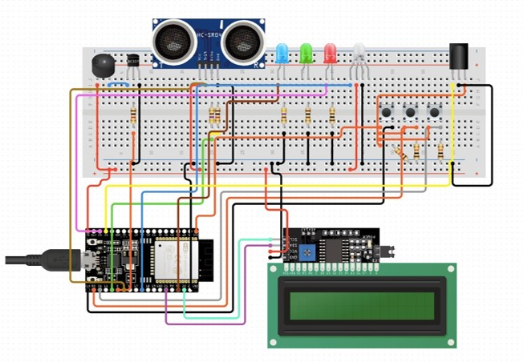
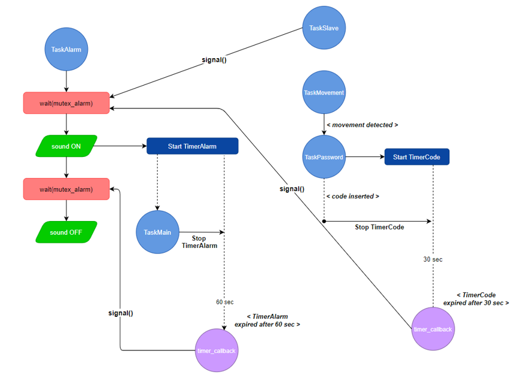
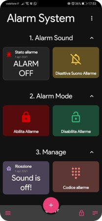
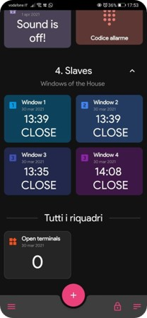

# Home Security System
Project of a Domotic Home Security System prototype.

## Description

The “Home Security System” project consists in the creation of a prototype of an alarm system, therefore the device is designed for domestic use. The application therefore aims to simulate the operation of an anti-theft alarm through the use of hardware components. In short: the opening / closing of the windows of a hypothetical house was simulated through the use of buttons and LEDs. The use of an ultrasonic distance sensor HC SR04 allowed the detection of "suspicious" movements inside the house while an acoustic signal allows the emission of the alarm sound. The LCD display is used to show messages and notifications and an infrared sensor allows - using the appropriate remote control - to enter the code for deactivating the alarm.

## Requirements

- Hardware Requirements
    - ESP32 Board
    - Ultrasonic Sensor HC-SR04
    - Display LCD 16x02
    - Infrared Receiver
    - Remote Control
    - Sound Buzzer
    - Buttons
    - Leds
    - Led RGB
    - Resistors
- Software Requirements
    - FreeRTOS OS
    - Arduino IDE
    - MQTT 

## Software Tools

The software tools used for the realization of the project are: Visual Studio Code as a development environment, Arduino IDE - with the FreeRTOS library for compiling and loading the program on the ESP32 board and git for sharing code. the realization of the project are: Visual Studio Code as a development environment, Arduino IDE - with the FreeRTOS library for Arduino - for compiling and loading the program on the ESP32 board and Git for code sharing between contributors.

## Tasks

Application tasks:
- TaskSlave: these are the 3 tasks that represent the windows of the house, and from hardware point-of-view their operation is implemented by buttons and LEDs. The windows are initially all closed. Pressing a button simulates the opening of a window which triggers the alarm.
- TaskAlarm:
- TaskMain:
- TaskConnection:
- TaskMovementDetection:
- TaskDisplay:
- TaskPassword:
- TaskSetAlarmButton:

## ESP32 Board

Product: 
https://www.espressif.com/en/products/socs/esp32

Docs:

https://docs.espressif.com/projects/esp-idf/en/latest/esp32/

## Circuit Schematics

## Synchronization

## MQTT Dashboard Application

Application available on the Play Store for Android Devices on this [link](https://play.google.com/store/apps/details?id=com.app.vetru.mqttdashboard)

<table>
  <tr>
    <td valign="top"></td>
    <td valign="top"></td>
  </tr>
</table>

## Authors

Fedy Haj Ali, Daniela Koreta
